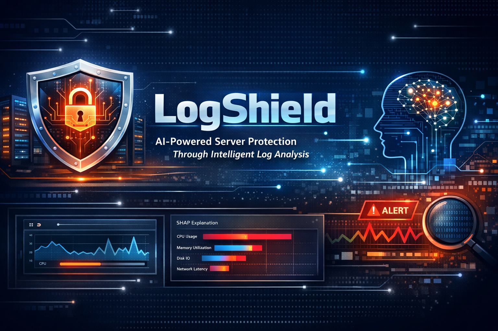

# 🛡️ LogShield  
### AI-Powered Server Protection Through Intelligent Log Analysis

**LogShield** is an enterprise-grade **AIOps observability platform** that monitors system logs in real time, predicts failures before they occur, and explains anomalies using machine learning and SHAP.

<p align="center">
  
  
  
  
</p>

---

## 🚀 Why LogShield?

Modern infrastructure generates **millions of log events per minute** — yet most outages are detected **after** systems degrade.

**LogShield** acts as an intelligent guardian for your servers:

✔ Detect anomalies early  
✔ Predict failures  
✔ Identify root causes  
✔ Explain ML decisions  
✔ Visualize health in real time  
✔ Simulate production incidents  

---

## 🧠 System Architecture

```mermaid
graph TD
    A[Log Sources] --> B[Log Simulator]
    B --> C[Preprocessing Engine]
    C --> D[ML Predictor + SHAP]
    D --> E[Flask Monitoring Dashboard]
````

---

## ✨ Core Capabilities

### 🔮 Predictive Monitoring

* Sliding-window inference
* Failure classification
* Confidence scoring
* Root-cause labeling

### 📊 Real-Time Dashboard

* CPU / Memory / Latency charts
* Incident alerts
* Health indicators
* Prediction history

### 🔍 Explainable AI (SHAP)

* Feature attribution
* Transparent decisions
* Trustworthy ML outputs

### 💥 Failure Injection Lab

* CPU spikes
* Memory leaks
* Network delays
* Database overloads

> Perfect for chaos-engineering and resilience testing.

---

## ⚙️ Quick Start

### 📦 Prerequisites

* Python 3.10+
* Virtual environment recommended

---

### 🛠️ Installation

```bash
python -m venv venv

# Windows
.\venv\Scripts\activate

# Mac / Linux
source venv/bin/activate

pip install -r requirements.txt
```

---

### ▶️ Run the Platform

**1️⃣ Start log simulation + inference**

```bash
python main.py
```

**2️⃣ Launch dashboard**

```bash
python dashboard/app.py
```

**3️⃣ Open browser**

👉 [http://127.0.0.1:5000](http://127.0.0.1:5000)

---

## 🗂️ Project Layout

```text
log_simulator/
├── dashboard/
│   ├── static/
│   ├── templates/
│   └── app.py
├── analysis/
│   └── explainer.py
├── logs/            # gitignored
├── models/          # gitignored
├── services/
├── main.py
├── controller.py
├── requirements.txt
└── README.md
```

---

## 📈 What Makes LogShield Stand Out?

🔥 Real-time ML inference
🔥 SHAP-based explanations
🔥 Failure injection engine
🔥 Enterprise-style UI
🔥 Modular micro-services design
🔥 Observability-first architecture

---

## 🧪 Demo Scenarios

| Failure Type  | Detection | Explanation | Dashboard |
| ------------- | --------- | ----------- | --------- |
| CPU Spike     | ✅         | ✅           | ✅         |
| Memory Leak   | ✅         | ✅           | ✅         |
| DB Overload   | ✅         | ✅           | ✅         |
| Network Delay | ✅         | ✅           | ✅         |

---

## 🛣️ Roadmap

* [x] Real-time inference engine
* [x] Interactive dashboard
* [x] Failure injection framework
* [x] SHAP explainability
* [ ] Auto-remediation system
* [ ] Cloud deployment
* [ ] CI/CD integration
* [ ] SLA forecasting

---

## 👨‍💻 Built For

* Academic research
* Final-year projects
* DevOps simulations
* Cloud demos
* AIOps experimentation

---

## ⭐ Support the Project

If you found this useful:

👉 **Star ⭐ the repository**
👉 Fork and extend
👉 Submit improvements

LogShield — guarding your servers with intelligence 🛡️
